# Bodhium System Architecture Diagram

## High-Level System Architecture

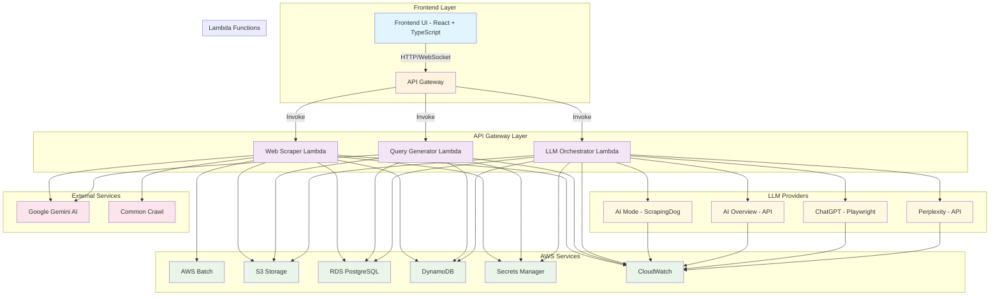

## Detailed Component Architecture

### 1. Web Scraper Component Architecture

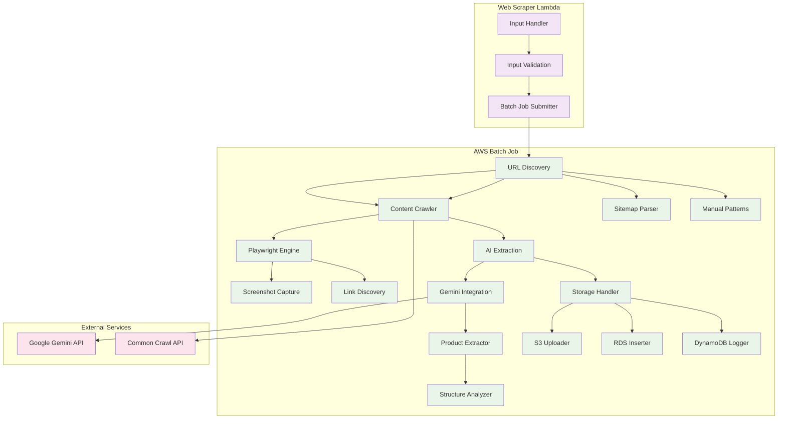

### 2. Query Generator Component Architecture

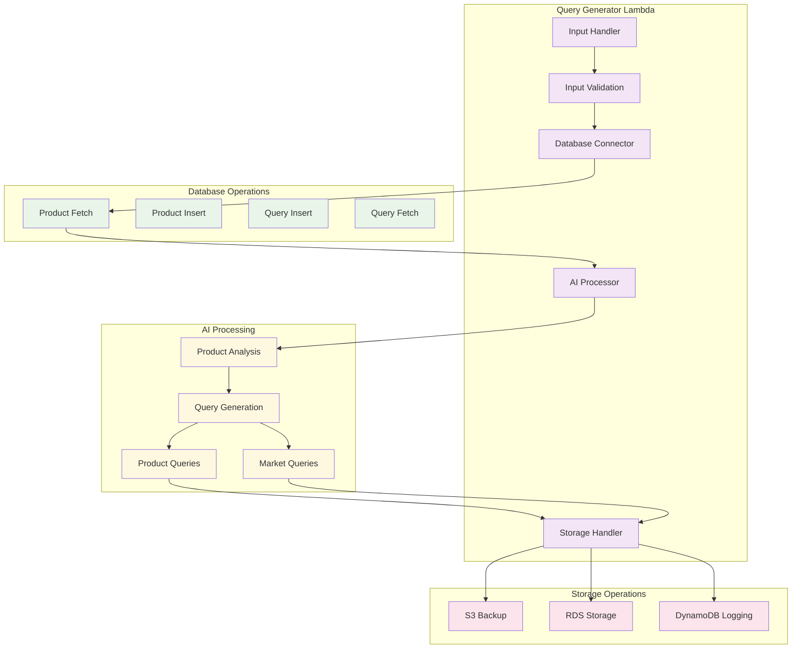

### 3. LLM Orchestrator Component Architecture

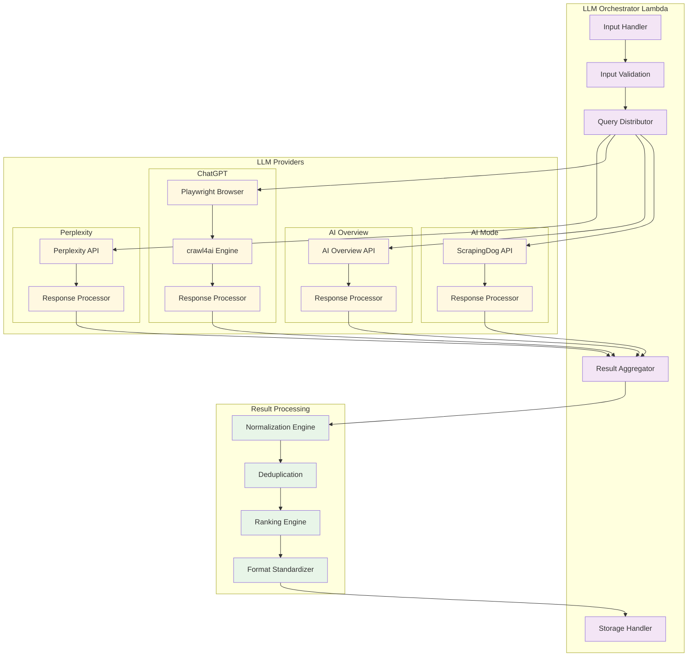

## Data Storage Architecture

### S3 Storage Structure

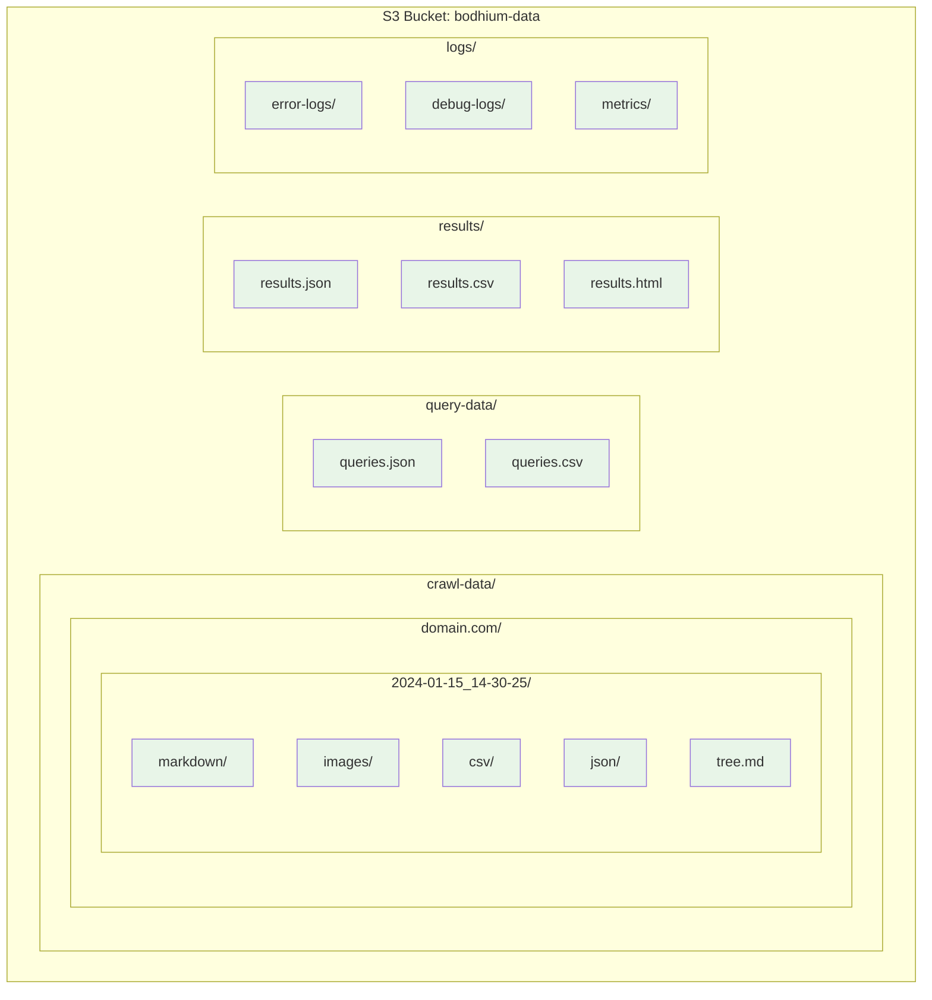

### RDS Database Schema

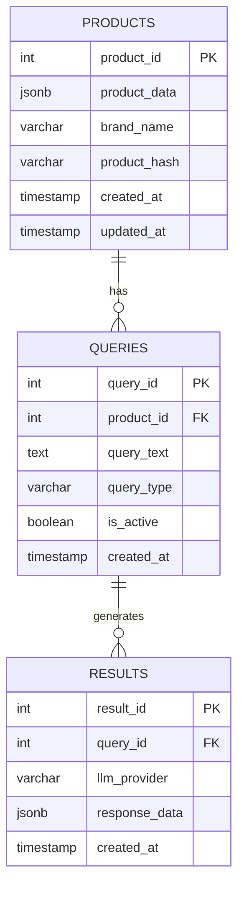

### DynamoDB Logging Structure

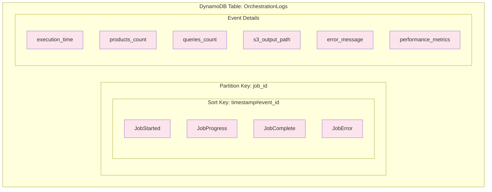

## Security Architecture

### Authentication and Authorization Flow

```mermaid
graph TD
    subgraph "Security Layer"
        AUTH[Authentication]
        AUTHZ[Authorization]
        ENCRYPT[Encryption]
        AUDIT[Audit Logging]
    end
    
    subgraph "API Gateway Security"
        API_KEY[API Key Validation]
        RATE_LIMIT[Rate Limiting]
        CORS[CORS Configuration]
        WAF[WAF Rules]
    end
    
    subgraph "Lambda Security"
        IAM_ROLE[IAM Roles]
        ENV_VARS[Environment Variables]
        SECRETS[Secrets Manager]
        VPC[VPC Configuration]
    end
    
    subgraph "Data Security"
        S3_ENCRYPT[S3 Encryption]
        RDS_ENCRYPT[RDS Encryption]
        DDB_ENCRYPT[DynamoDB Encryption]
        TLS[TLS/SSL]
    end
    
    AUTH --> API_KEY
    AUTHZ --> IAM_ROLE
    ENCRYPT --> S3_ENCRYPT
    ENCRYPT --> RDS_ENCRYPT
    ENCRYPT --> DDB_ENCRYPT
    ENCRYPT --> TLS
    AUDIT --> DDB_ENCRYPT
    
    %% Styling
    classDef security fill:#ffebee
    classDef api fill:#fff3e0
    classDef lambda fill:#f3e5f5
    classDef data fill:#e8f5e8
    
    class AUTH,AUTHZ,ENCRYPT,AUDIT security
    class API_KEY,RATE_LIMIT,CORS,WAF api
    class IAM_ROLE,ENV_VARS,SECRETS,VPC lambda
    class S3_ENCRYPT,RDS_ENCRYPT,DDB_ENCRYPT,TLS data
```

## Performance Architecture

### Scalability and Load Balancing

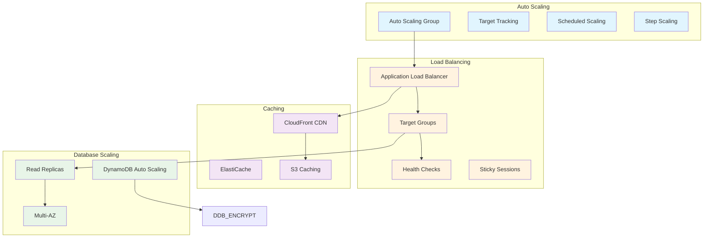

## Monitoring and Observability

### CloudWatch Monitoring Stack

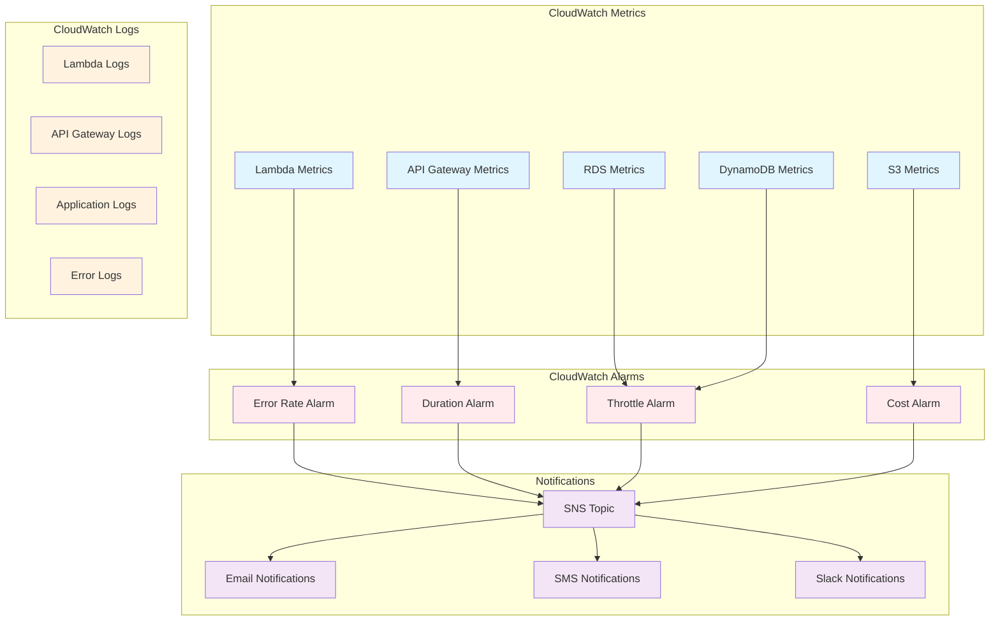

## Cost Optimization Architecture

### Resource Management and Cost Control

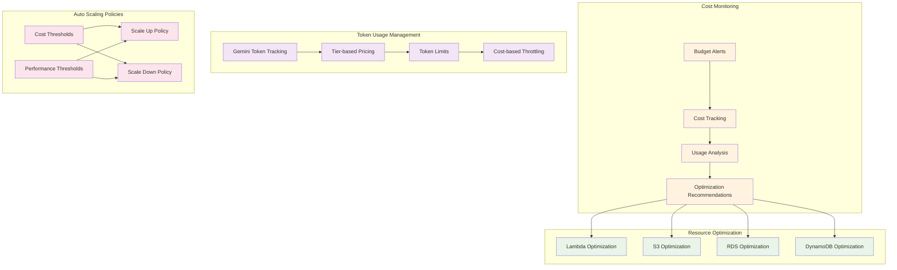

## Complete System Integration

### End-to-End Architecture Overview

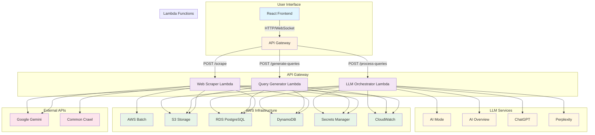

## Architecture Principles

### 1. Scalability
- **Horizontal Scaling**: Lambda functions auto-scale based on demand
- **Database Scaling**: RDS read replicas and DynamoDB auto-scaling
- **Storage Scaling**: S3 with unlimited storage capacity

### 2. Reliability
- **Fault Tolerance**: Multi-AZ deployment for RDS
- **Error Handling**: Comprehensive retry logic and fallback mechanisms
- **Data Durability**: S3 99.999999999% durability

### 3. Security
- **Encryption**: Data encrypted at rest and in transit
- **Access Control**: IAM roles and policies
- **Secrets Management**: AWS Secrets Manager for API keys

### 4. Performance
- **Parallel Processing**: 4 LLM providers working simultaneously
- **Caching**: CloudFront CDN and ElastiCache
- **Optimization**: Lambda provisioned concurrency

### 5. Cost Optimization
- **Pay-per-use**: Lambda and DynamoDB pricing
- **Token Management**: Tiered pricing for Gemini API
- **Resource Optimization**: Auto-scaling based on usage

### 6. Monitoring
- **Comprehensive Logging**: CloudWatch logs and metrics
- **Real-time Alerts**: SNS notifications for critical events
- **Performance Tracking**: Detailed execution metrics

This architecture provides a robust, scalable, and cost-effective solution for AI-powered web scraping and analysis, with comprehensive monitoring and security features. 