# Bodhium System Flow Diagram

## Complete System Flow

## Detailed Component Flow

### 1. URL Input and Web Scraping Flow

### 2. Query Generation Flow

### 3. LLM Orchestration Flow

## Data Storage Flow

## Error Handling Flow

## Real-time Processing Flow

## Security and Authentication Flow

## Performance Monitoring Flow

## Cost Optimization Flow

```mermaid
graph TD
    A[Token Usage] --> B[Gemini API]
    B --> C[Cost Calculation]
    C --> D{Standard Tier?}
    D -->|Yes| E[≤128k tokens]
    D -->|No| F[>128k tokens]
    
    E --> G[$0.075/1M input]
    F --> H[$0.15/1M input]
    
    G --> I[Cost Tracking]
    H --> I
    I --> J[Budget Alert]
    
    J --> K{Budget Exceeded?}
    K -->|Yes| L[Throttle Requests]
    K -->|No| M[Continue Processing]
    
    %% Styling
    classDef cost fill:#fff3e0
    classDef alert fill:#ffebee
    classDef action fill:#e8f5e8
    
    class A,B,C,D,E,F,G,H,I cost
    class J,K alert
    class L,M action
```

## Complete End-to-End Flow Summary

### Phase 1: URL Processing (5-10 minutes)
1. **User Input**: URL submitted through frontend or API
2. **Web Scraping**: AWS Batch job crawls website and extracts products
3. **AI Processing**: Google Gemini analyzes and structures product data
4. **Storage**: Results saved to S3 and RDS

### Phase 2: Query Generation (2-3 minutes)
1. **Product Analysis**: Query Generator analyzes scraped products
2. **AI Generation**: Gemini creates 50 queries per product (25 product + 25 market)
3. **Database Storage**: Queries stored in RDS with product associations
4. **S3 Backup**: Query data backed up to S3

### Phase 3: LLM Processing (2-3 minutes)
1. **Orchestration**: LLM Orchestrator distributes queries to 4 providers
2. **Parallel Processing**: All providers process queries simultaneously
3. **Result Aggregation**: Results combined and normalized
4. **Storage**: Final results saved to S3 and RDS

### Phase 4: Result Display (Real-time)
1. **Frontend Updates**: Real-time streaming of results to UI
2. **User Interaction**: Users can view, filter, and export results
3. **Logging**: All events logged to DynamoDB for monitoring

### Key Performance Indicators
- **Total Processing Time**: 9-16 minutes end-to-end
- **Parallel Processing**: 4 LLM providers working simultaneously
- **Data Storage**: Comprehensive storage in S3, RDS, and DynamoDB
- **Real-time Updates**: Live streaming of results to frontend
- **Error Handling**: Robust error handling with retry logic
- **Cost Optimization**: Tiered pricing and budget monitoring 